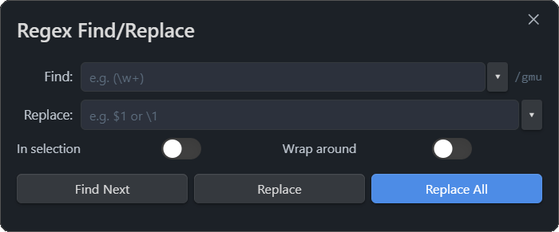

# Obsidian Plugin - Power of Regex
Provides a dialog to find and replace text in the currently opened note.
In addition to Obsidians on-board find/repace function, this plugin provides options to
- use regular expressions with customizable flags
- replace found occurances in the currently selected text or in the whole document

Desktop as well as mobile versions of Obsidian are supported.

## How to use
- Type `regex` in the command palette and open it as a popup or side panel.
- Use the text boxes to type the expression to find a match, and another one to replace it with.
- The plugin will remember the last recent search/replace parameters.
- Some supported regular expression syntax can be found in the settings for reference.
- You can choose what flags you want to have active via the settings
- I suggest to rebind the "Replace" hotkey to `Crtl + F` and then bind the "RegEx Popup" to `Crtl + H`, or use the side panel.

## How to install
### From inside Obsidian
This plugin can be installed via the `Community Plugins` tab in the Obsidian Options dialog:
- Disable Safe Mode (to enable community plugins to be installed)
- Browse the community plugins searching for "power of regex"
- Install the Plugin
- Enable the plugin after installation

### Manual installation
The plugin can also be installed manually from the repository:
- Create a new directory in your vaults plugins directory, e.g.   
   `.obsidian/plugins/power-of-regex`

- Head over to https://github.com/Silt-Strider/power-of-regex.git

- From the latest release, download the files
   - main.js
   - manifest.json
   - styles.css

  to your newly created plugin directory
- Launch Obsidian and open the Settings dialog
- Disable Safe Mode in the `Community Plugins` tab (this enables community plugins to be enabled)
- Enable the new plugin

## Future Plans
- Option to "favorite" regular expressions
- If-Then logic functionality
- Add option to find & replace in vault folder

## Version History

### 1.0.0
- Initial release of [Regex Find/Replace](https://github.com/Gru80/obsidian-regex-replace)

### 1.1.0
- Case insensitive search can now be enabled in the settings panel of the plugin (regex flag `/i`)
- Find-in-selection toggle switch is disabled if no text is selected in the note
- Performance improvements and bug-fixes

### 1.2.0
- Option to interpret `\n` in replace field to insert line-break accordingly
- Option to pre-fill the find-field with the selected word or phrase
- Used regex-modifier flags are shown in the dialog
 
### 1.3.0
- Resumed plugin development after the previous author had 4 years of inactivity (for personal use)
- Made the window remember last used options in "Find" and "Replace" text field
- Added functionallity to reference groups with `\1` to `\9`

### 2.0.0
- Organizational:
	- Decided to share the modified plugin (permission was granted in his license)
	- Released "Power of RegEx" on GitHub and submitted to review for Obsidian
	- Refactored code with Claude (reviewed it of course)
- Functionality:
	- Added a side panel with the same functionality as the popup
	- Added a "Replace" and "Find Next" button
	- Added longer history length and a drop down menu to select them (using up and down arrows also work)
	- History can be configured in the settings
	- Added regex flags to settings (`/gimusy`)
	- Now supports CJK characters (regex flag `/u`)
	- Added toggleable "Wrap around" setting
- User Interface:
	- Removed option "Use regular expression"     (now always active)
	- Removed option "Process `\n` as line break" (now always active)
	- Removed option "Process `\t` as tab"        (now always active)
	- Added regex reference help to settings menu
	- The toggleable setting "Selection only" is now always visible
	- Pressing "Enter" now either triggers "Find Next" or "Replace All", depending on the text box.
- Bug Fixes:
	- Clicking "Replace All" no longer scrolls to top of note and unfolds all headers and lists

